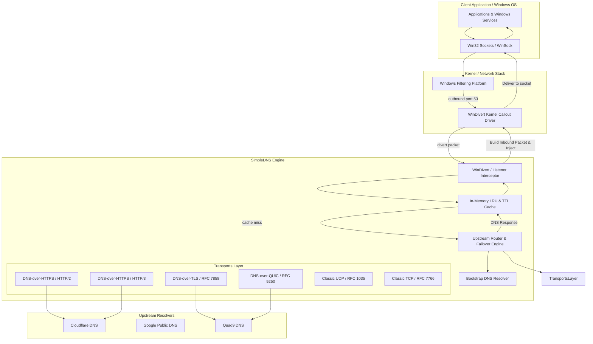

# SimpleDNS Architecture & Design Decisions

SimpleDNS is engineered from the ground up as a high-performance, transparent DNS client for Microsoft Windows. It intercepts outbound DNS queries system-wide at the network layer and securely routes them across modern encrypted DNS transports—including DNS-over-HTTPS (DoH), DNS-over-TLS (DoT), DNS-over-QUIC (DoQ), and DNS-over-HTTPS over HTTP/3 (DoH3)—without requiring the user to reconfigure Windows network adapters to point to `127.0.0.1`.

---

## 1. High-Level Component Architecture

---

## 2. Core Subsystems

### 2.1 The Interceptor Layer (`pkg/interceptor`)
The interceptor layer abstracts how DNS queries enter SimpleDNS:
* **`WinDivertInterceptor` (Default / Transparent)**:
  Uses the official, Microsoft-attested WinDivert driver (built upon Windows Filtering Platform kernel callouts) to divert outbound packets targeting UDP/TCP port 53.
  * Captures IPv4 and IPv6 packets before they leave the host.
  * Dissects the packet in pure Go with sub-35ns latency.
  * Forwards the DNS payload to the Engine.
  * Reverses source and destination IP addresses and ports.
  * Recomputes RFC 1071 / 768 / 2460 checksums.
  * Marks the packet as inbound (`Outbound = false`) and impostor (`Impostor = true`), injecting it back into the local TCP/IP stack.
* **`LocalListenerInterceptor` (Testing / Fallback)**:
  Binds standard UDP and TCP listeners on a local address (e.g. `127.0.0.1:5354`). Used for testing, development, and scenarios where administrative privileges are unavailable.

### 2.2 The DNS Message Engine (`pkg/dnsmsg`)
SimpleDNS is a full protocol-compliant DNS client, not a byte tunnel:
* **EDNS0 Handling**: Injects or updates EDNS0 `OPT` pseudo-records with a 1232-byte UDP buffer size (DNS Flag Day standard), preventing IP packet fragmentation while accommodating modern large DNSSEC responses.
* **DNSSEC Pass-Through**: Preserves the DNSSEC OK (`DO`) bit and Checking Disabled (`CD`) bit, ensuring DNSSEC-validating client applications work transparently.
* **Query ID Matching**: Ensures response transaction IDs strictly match the client's query ID to satisfy the Windows resolver's security checks.
* **Truncation & Error Handling**: Synthesizes standard DNS error responses (e.g. `SERVFAIL`, `REFUSED`, `FORMERR`) with correct response flags when upstreams fail.

### 2.3 The DNS Cache (`pkg/cache`)
To minimize latency and prevent upstream load:
* **Thread-Safe LRU Eviction**: Bounded memory footprint (default 4096 entries).
* **Dynamic TTL Decrement**: Calculates remaining TTL based on elapsed time so downstream applications and the Windows `Dnscache` service do not cache stale data.
* **Negative Caching**: Caches `NXDOMAIN` (domain does not exist) and `NODATA` responses based on the upstream SOA `MINIMUM` field or configured negative TTL (RFC 2308).
* **Truncation Immunity**: Truncated responses (`TC=1`) are never cached.

### 2.4 The Bootstrap Resolver (`pkg/bootstrap`)
Resolves endpoint hostnames for encrypted resolvers (e.g. `cloudflare-dns.com` -> `104.16.132.229`):
* **Circular Dependency Immunity**: Bootstrap servers are strictly validated as raw IP addresses, never hostnames.
* **Singleflight Deduplication**: Eliminates thundering-herd duplicate bootstrap lookups.
* **IP Preference Sorting**: Configurable preference for IPv4, IPv6, or dual-stack.
* **Failover**: Cycles through multiple configured bootstrap servers (default: Cloudflare, Google, Quad9) with retries.

### 2.5 The Upstream Pool & Routing Engine (`pkg/upstream`)
Orchestrates outbound encrypted resolution:
* **Selection Strategies**:
  * `priority`: Uses highest-priority upstream (lowest integer), automatically failing over to secondary upstreams on consecutive failures.
  * `round_robin`: Distributes queries evenly across healthy upstreams.
  * `fastest`: Dynamically routes queries to the resolver with the lowest exponential moving average latency.
* **Health Probing**: Background worker periodically probes degraded or down upstreams using lightweight queries to restore them to `Healthy` state upon recovery.
* **Privacy Safeguard**: When all upstreams fail, SimpleDNS refuses to leak queries in plaintext unless `allow_plaintext_fallback: true` is explicitly configured.

---

## 3. Concurrency & Performance Model

| Component | Concurrency Model | Performance Profile |
|---|---|---|
| WinDivert Workers | Configurable pool (default: CPU cores) | ~33 ns per packet parse, 1 alloc |
| DNS Wire Packing | `miekg/dns` fast pack/unpack | ~131 ns pack, ~252 ns parse |
| In-Memory Cache | RWLock + `container/list` LRU | ~309 ns per read hit |
| HTTP/2 (DoH) | Persistent connection pool + keep-alive | Multiplexed streams over single TLS connection |
| HTTP/3 (DoH3) | `quic-go/http3` QUIC multiplexing | Zero head-of-line blocking |
| DoQ (RFC 9250) | Single QUIC connection with pooled streams | Bi-directional streams per query, 2-byte framing |
| Idle Resource Usage | Event-driven I/O, zero busy loops | < 15 MB RAM, 0.0% idle CPU |
