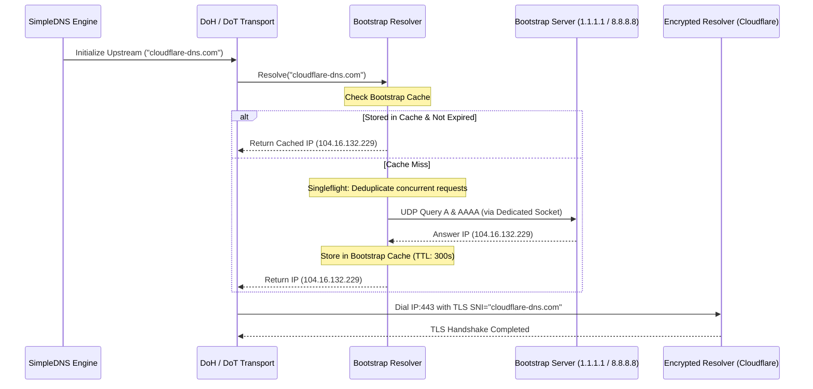

# Bootstrap DNS & Circular Dependency Resolution

Encrypted DNS endpoints typically use domain names rather than raw IP addresses (e.g. `https://cloudflare-dns.com/dns-query`, `dns.google:853`, `dns.quad9.net:853`). This introduces a fundamental bootstrapping challenge:

> *To resolve domain names securely via DoH/DoT, the client must first resolve the IP address of the DoH/DoT server itself.*
> *If the client attempts to resolve `cloudflare-dns.com` by querying its own interceptor, an infinite recursion loop occurs.*

SimpleDNS resolves this challenge through a dedicated, isolated **Bootstrap Resolver** (`pkg/bootstrap`).

---

## 1. How Bootstrap DNS Works



---

## 2. Hardening Measures

### 2.1 Anti-Recursion & Circular Dependency Elimination
1. **Raw IP Requirement**: All bootstrap server addresses in `bootstrap.servers` must be raw IPv4 or IPv6 addresses (e.g. `1.1.1.1:53`, `[2606:4700:4700::1111]:53`). Configuring a hostname as a bootstrap server is rejected by strict validation during configuration load.
2. **Dedicated Outbound Sockets**: Bootstrap resolution queries are executed over dedicated ephemeral sockets directly to bootstrap IPs.
3. **Kernel Filter Exemption with Dual-Stack Guards**: Standard Windows sockets generated by Go's network runtime do not have the kernel `impostor` bit set. To prevent WinDivert from intercepting SimpleDNS's own queries to bootstrap servers, SimpleDNS automatically appends dual-stack exemption guards (`(!ip or (ip.DstAddr != ...))` and `(!ipv6 or (ipv6.DstAddr != ...))`) to the WinDivert filter string.
4. **Scope Limitation**: The Bootstrap Resolver is exclusively used to resolve upstream endpoint hostnames. General client application queries are NEVER routed through the bootstrap resolver.

### 2.2 Direct IP Endpoints with TLS SNI (Zero Bootstrap Overhead)
If you know the IP addresses of your upstream DNS servers (or prefer querying public providers directly by IP), you can specify raw IP URLs directly in the upstream configuration:
```yaml
upstreams:
  - name: "Cloudflare DoH3 (Direct IPv6)"
    transport: "doh3"
    endpoint: "https://[2606:4700:4700::1111]/dns-query"
    hostname: "cloudflare-dns.com" # Used for TLS SNI and HTTP Host header
    port: 443
```
When `endpoint` uses a raw IP address, SimpleDNS connects directly without issuing any bootstrap DNS queries. The `hostname` field supplies the expected TLS SNI and HTTP `Host` header, ensuring 100% strict certificate validation and virtual host routing.

### 2.3 Singleflight Deduplication
If multiple worker goroutines initialize or attempt to resolve the same upstream hostname simultaneously, `pkg/bootstrap` uses singleflight synchronization to issue exactly **one** network lookup. All concurrent callers wait for that single lookup to complete, preventing thundering-herd spikes against bootstrap resolvers.

### 2.4 Multiple Bootstrap Servers & Failover
SimpleDNS supports an arbitrary list of bootstrap servers. If the primary bootstrap server fails or times out:
1. Retries the query up to `retries` times.
2. Automatically fails over to the next configured bootstrap server.
3. If all bootstrap servers fail, SimpleDNS checks whether a stale cached IP is available. If present, it uses the stale entry as a resilient best-effort fallback.

---

## 3. Configuration & Defaults

```yaml
bootstrap:
  # Default bootstrap DNS servers
  servers:
    - "1.1.1.1:53"
    - "8.8.8.8:53"
    - "9.9.9.9:53"
    - "[2606:4700:4700::1111]:53"
    - "[2001:4860:4860::8888]:53"

  # Query timeout
  timeout: "2s"

  # Retries per server before failover
  retries: 2

  # Cache TTL for resolved IPs
  cache_ttl: "300s"

  # IP Preference: "prefer_ipv4", "prefer_ipv6", "ipv4_only", "ipv6_only", "dual"
  ip_preference: "prefer_ipv4"
```

---

## 4. Privacy & Fallback Policy

A critical privacy vulnerability in many DNS clients is **silent plaintext fallback**: when encrypted resolution fails, the client quietly downgrades to unencrypted plaintext DNS without notifying the user, exposing their queries to local network eavesdropping.

SimpleDNS enforces strict privacy defaults:
* **`allow_plaintext_fallback: false` (Default)**: If all encrypted upstreams are down, SimpleDNS returns `SERVFAIL` to client applications and logs an error. Queries are **NEVER** silently broadcast to unencrypted DNS.
* **`allow_plaintext_fallback: true` (Explicit Opt-In Only)**: Only when the user deliberately enables this setting will SimpleDNS fall back to querying the bootstrap servers in plaintext when all encrypted upstreams fail.
